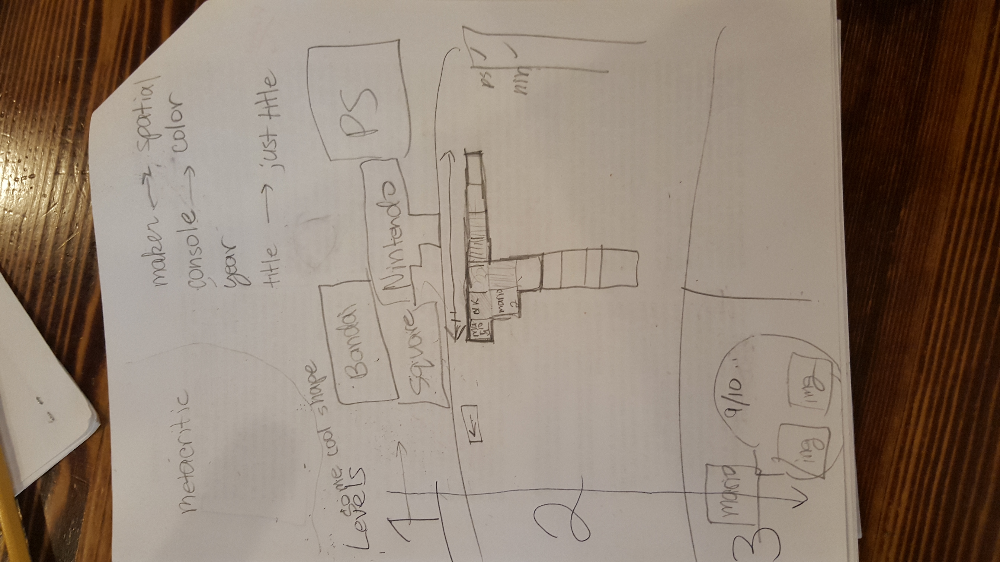
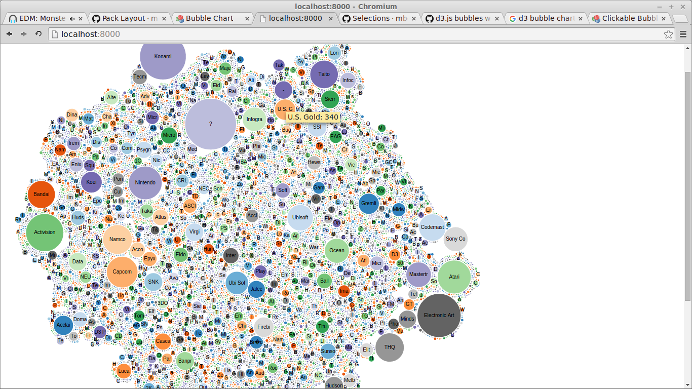

# all-of-the-games
A visualization of all of the video games.

## To Do


###### D3
Make it so when you click on a maker circle, it zooms in and shows all the **games on a timeline**.
Games are color coded **by console**.
When a game is clicked, information should be pulled from Google Images/IGN/Metacritic/Wikipedia etc.

###### Preprocessing
Group the makers by connectedness

Cleanup
* Ubi Soft = Ubisoft
* Some rows are split into 2 lines

###### Joining more data
* Metacritic
* Maker revenue
* Images

## Data
```javascript
{
	"maker1": [
				3,
				["game1", "1998", "N64"],
				["game2", "1998", "PS4"]
				["game3", "1998", "Sega Genesis"]
			]
	"maker2": [
				1,
				["game1", "1988", "Atari"],
			]
}
```

## Progress

